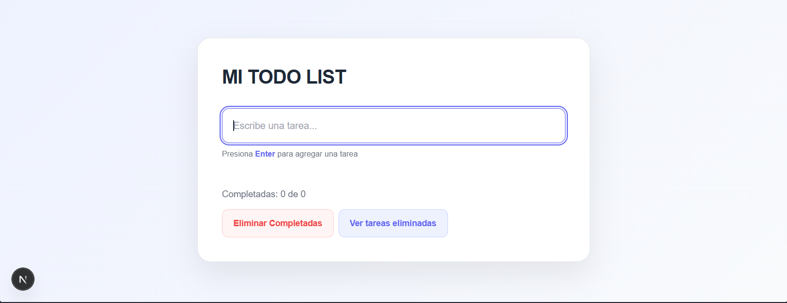
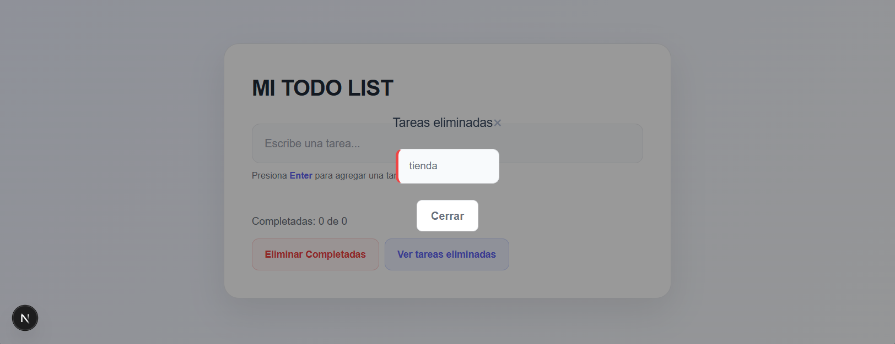
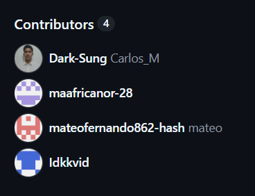

# 📝 Mi todo list

Aplicación web de lista de tareas desarrollada con Nexts.js, React y Typescript.

## 📌 Descripción 
Esta aplicación permite gestionar tareas de manera sencilla. Ek usuario puede agregar, editar, completar y eliminarr tareas.
Como nueva funcionalidad, se implementó una **papelera de tareas eliminadas**, donde se almacenan las tareas antes de desaparecer de la lista principal.

## 🌐 Funcionalidades principales 
- Agrega tareas.
- Edita tareas.
- Marca tareas como completadas.
- Eliminar tareas.
- Eliminar todas las tareas completadas.
- Consulta las tareas eliminadas mediante la papelera.

## 🆕 Papelera de tareas eliminadas
Cuando una tarea es eliminada, se lamacena en la lista **Tareas eliminadas** antes de desaparecer de la lista principal.

También se almacenan en la papelera las tareas eliminadas mediante la opción **Eliminar completadas**.

La papelera puede consultarse mediante el botón: **"Ver tareas eliminadas"**

## 🛠️ Tecnologías utilizadas
-Next.js
-React
-TypeScript
-CSS
-localStorage

## 🚀Instalación
Clonar el repositorio y entrar en la carpeta del proyecto.

Instalar las dependencias:
```bash
npm install
```
## Integrantes 
- Mac Africano Restrepo
- Carlos Monroy Vázquez
- Vidal Niebles Cáceres
- Mateo Pérez Núñez

## 📸 Capturas

### Listas principal


### Tareas eliminadas


### Equipo
